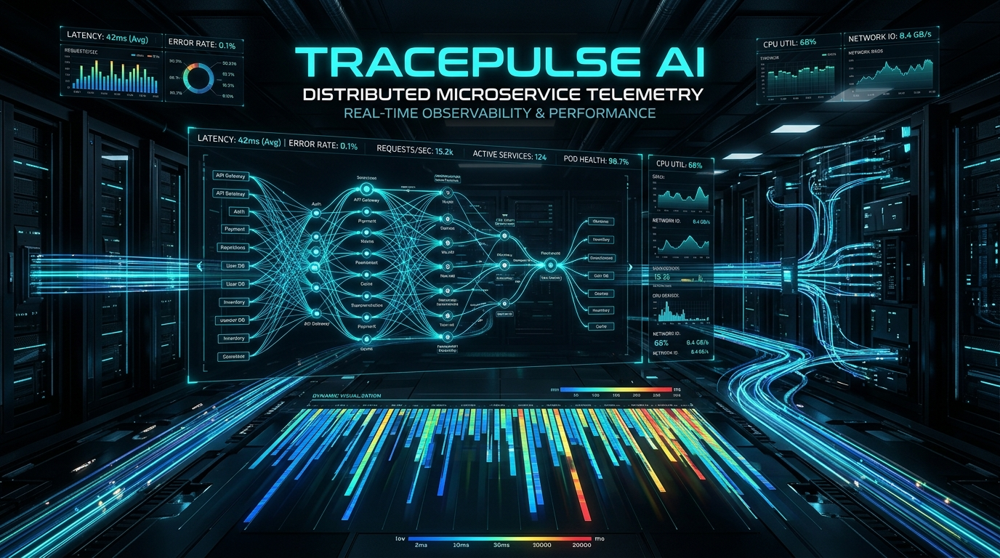

# ⚡ TracePulse AI
### Real-Time Distributed Telemetry, Latency SLA Budget Profiler & Cascade Bottleneck Isolation Engine

[-emerald?style=flat-square&logo=python)](https://github.com/Naveen57990/TracePulse)
[](https://opensource.org/licenses/MIT)
[](https://github.com/Naveen57990/TracePulse)



---

## 💡 What is TracePulse AI?

Modern distributed microservice architectures, cloud-native meshes, and edge applications suffer from **silent tail-latency amplification**, **uncontrolled cascade retry storms**, and **unisolated bottleneck propagation**. Traditional observability tools are heavyweight, costly, and introduce severe telemetry overhead.

**TracePulse AI** is a lightweight, zero-dependency distributed telemetry profiler and execution DAG analyzer. It parses distributed span hierarchies, calculates exact critical paths, profiles latency percentiles ($p_{50}, p_{90}, p_{95}, p_{99}$), evaluates SLA breach risks, and automatically pinpoints root-cause service bottlenecks with synthesized remediations.

---

## 🚀 Key Capabilities

1. **Distributed DAG Execution Analyzer**: Builds hierarchical parent-child span trees, determines critical execution paths, and computes concurrent execution ratios.
2. **Deterministic Latency Budgeting**: Real-time SLA headroom calculation, quantile evaluation, and tail amplification indexing ($p_{99} / p_{50}$).
3. **Automated Root-Cause Isolation**: Identifies anomalous microservice delays using exclusive span self-time, eliminating false positives from outer caller wrappers.
4. **Interactive Cyberdeck Web Console**: Live SVG waterfall visualization, dynamic fault injection (DB connection pool stall, cache miss storms, upstream jitter), and custom OpenTelemetry/Jaeger JSON dropzone.
5. **High-Velocity Tactical CLI**: Zero-dependency command-line utility for CI/CD observability pipelines and load-testing scripts.

---

## 🏗️ System Architecture

```
                                  [ Incoming Distributed Trace JSON / OpenTelemetry Spans ]
                                                              │
                                                              ▼
                                              ┌───────────────────────────────┐
                                              │    SpanGraph Engine (DAG)     │
                                              │  - Parent-Child Span Linking  │
                                              │  - Critical Path Calculation  │
                                              │  - Concurrency Ratio (Wall)   │
                                              └───────────────┬───────────────┘
                                                              │
                              ┌───────────────────────────────┴───────────────────────────────┐
                              ▼                                                               ▼
              ┌───────────────────────────────┐                               ┌───────────────────────────────┐
              │ Latency SLA Budget Profiler   │                               │ Root-Cause Bottleneck Engine  │
              │ - p50, p90, p95, p99 Quantiles│                               │ - Span Self-Time Isolation    │
              │ - Headroom & Breach Risk Eval │                               │ - Cascade Storm Detection     │
              │ - Microservice SLA Allocation │                               │ - Synthesized Remediations    │
              └───────────────┬───────────────┘                               └───────────────┬───────────────┘
                              │                                                               │
                              └───────────────────────────────┬───────────────────────────────┘
                                                              ▼
                                              ┌───────────────────────────────┐
                                              │     TracePulse Web Console    │
                                              │  - Real-Time Waterfall DAG    │
                                              │  - Fault Injection Sandbox    │
                                              │  - Custom JSON Telemetry Drop │
                                              └───────────────────────────────┘
```

---

## ⚡ Quickstart Guide

### 1. Run Deterministic Unit Test Suite
```bash
python3 -m unittest tracepulse/engine/test_tracepulse.py -v
```
Output:
```text
Ran 8 tests in 0.000s
OK
```

### 2. Tactical CLI Commands
```bash
# Analyze a distributed trace fixture
python3 -m tracepulse.cli.main analyze --file tracepulse/fixtures/sample_trace.json

# Profile latency sample distribution and SLA budget compliance
python3 -m tracepulse.cli.main latency --file tracepulse/fixtures/sample_latencies.json --sla 250.0
```

### 3. Launch Web Cyberdeck Console
Open `tracepulse/web/index.html` directly in any web browser, or serve locally:
```bash
python3 -m http.server 8080 --directory tracepulse/web
```

---

## 📦 Service Breakdown & Telemetry Metrics

| Metric | Purpose | Typical Target |
| :--- | :--- | :--- |
| **Total Wall Duration** | Actual wall-clock time from first span start to last span end | `< 200 ms` |
| **Concurrency Ratio** | Sum of span durations over total wall duration ($>1.0$ indicates parallelism) | `1.5x - 3.5x` |
| **Tail Amplification** | $p_{99} / p_{50}$ ratio (quantifies outlier latency degradation) | `< 2.5x` |
| **SLA Headroom** | Target SLA minus calculated $p_{95}$ latency | `> +20 ms` |

---

## 🛡️ License
Released under the open-source [MIT License](LICENSE).
